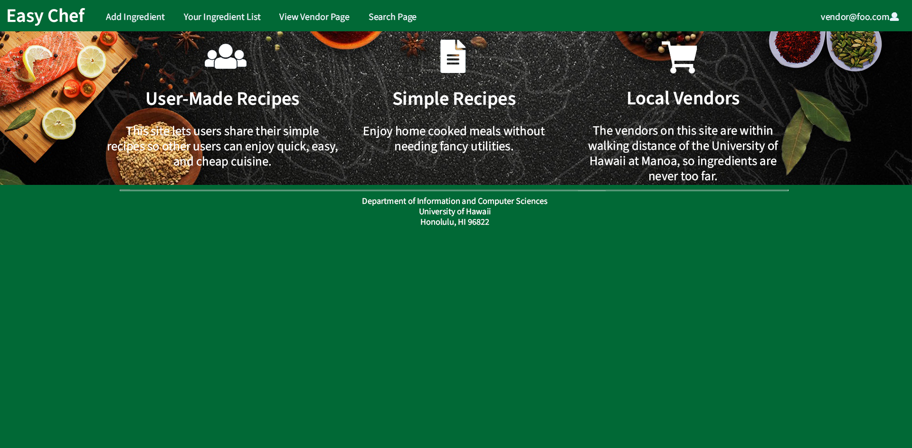
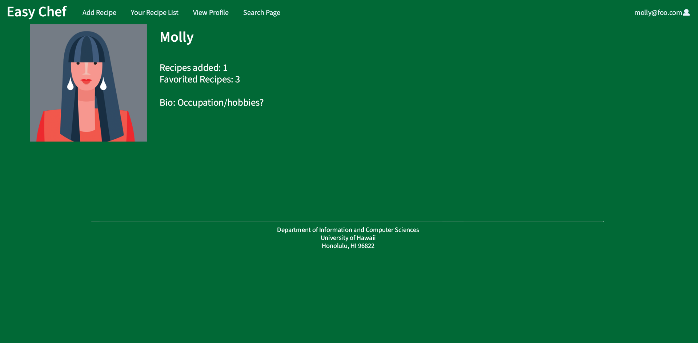
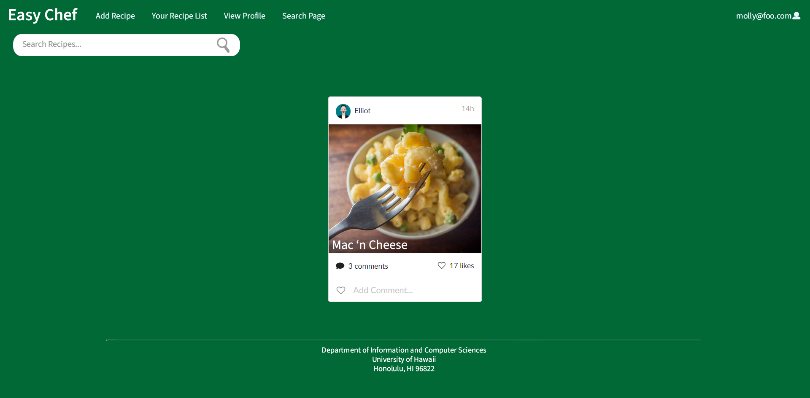
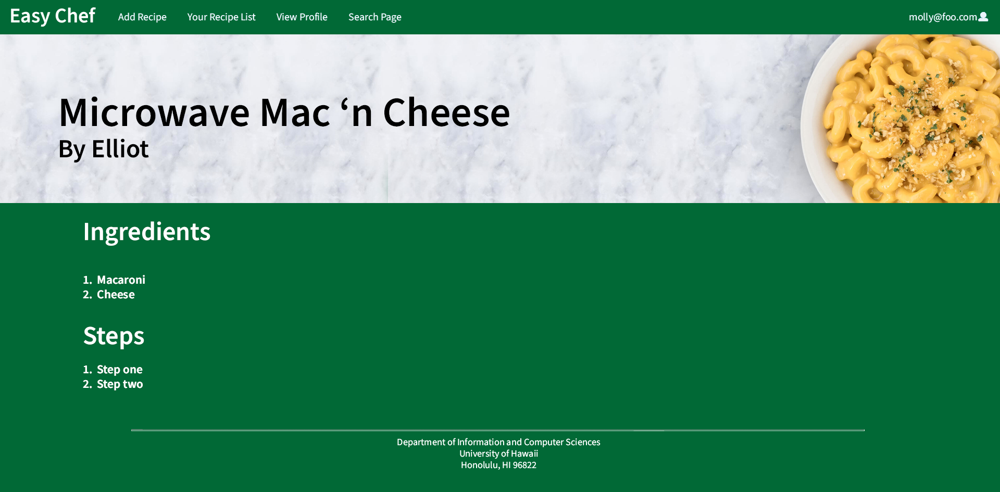

## Table of contents

* [Overview](#overview)
* [Deployment](#deployment)
* [User Guide](#user-guide)
* [Pre-Development Mockup](#pre-development-mockup)
* [Development History and Milestones](#development-history-and-milestones)
* [Team](#team)

## Overview

For college students, money is always of concern for anything including the meals that we prepare. Creating meals can be
difficult for various reasons such as limited kitchen resources, cooking ability, and ingredient availability. No longer will a
student simply resort to only a cup of noodles. With EasyChef, anyone can discover delicious recipes that is easy to
make.

EasyChef is a web application that provides pages to view and (in some cases) modify profiles, recipes, and
vendors. The goal is provide an application that the UH community will use in order discover simple and affordable
recipes for their meals including where to get its associated ingredients. It illustrates various technologies
including:

* [Meteor](https://www.meteor.com/): Framework used for server and client code.
* [React](https://reactjs.org/): A Javascript library used to implement UI design.
* [Semantic UI React](https://react.semantic-ui.com/): CSS framework within react to implement UI components.
* [Uniforms](https://uniforms.tools/): Used to present and display form information when users create new items.

The following is what is currently planned for what the system will eventually provide:

* Three primary collections (Profiles, Recipes, Vendors) as well as two "join" Collections (ProfilesRecipes,
  VendorItems) that implement many-to-many relationships between them.
* Top-level index pages (Profiles, Recipes, Vendors) that will manipulate the collections above.
* Authentication system using the Meteor accounts package to verify the credentials of who logs-in to the system.
* Notification system that connects with the VendorItems and ProfilesRecipes collection to notify when items are on sale or when a user has used an ingredient in their recipe.
* Rating system to rate student posted recipes and quality of items posted by recipes.
* Map of the UH campus community to allow students to find ingredients posted by vendors and see if a certain vendor item is available at a certain location (ex. Foodland @ Ala Moana).

## Deployment

A live deployment of EasyChef is soon to be available on Digital Ocean and will be accessible here when ready.

## User Guide

This section is soon to be available.

## Pre-Development Mockup

The UI mockups below were created using Photoshop and serves as the basis for the development for [Milestone 1.](https://github.com/easy-chef/easy-chef/projects/1)

### Landing Page

The landing page is presented to users when they visit the top-level URL to the site. It will be similar to the image
below that will serve as a basis for the final design:

### User Home Page

The user home page is presented after a user logs-in with an account that has the "student" role. This page is similar to the landing page with the addition of new options such as "Add Recipe" that is available at the top of the navigation bar.

### Vendor Home Page

The vendor home page is presented after a user logs-in with an account that has "vendor" role. Accounts with the "vendor" role will have unique options in the navigation bar such as "Add Ingredient."

### Admin Home Page

The admin home page is presented after a user logs-in with an account that "admin" role. Accounts with the "admin" role has an additional option in the navigation bar called "Admin" that allows one to view all items (users, recipes, vendors, etc.) in the system.

### User Profile Page

Each user will have a personalized profile that presents information such as count of recipes added as well as favorite recipes shared by other users.  It will also present a bio where users can describe themselves within the UH community.  The mockup below represents a sample student profile.  Vendors may have profiles with other types of information.

### NavBar Search Engine

A dedicated page to search all recipes that has been posted to the application.  Here, users can search by name and filter results based on dietary restrictions.  The page will present a list of cards with recipes that meet the search results. 

### Individual Recipe Page

The page dedicated to displaying information of a recipe that have been created by a student.  This page present information such as the recipe name, author, image, ingredients, and steps.  The ingredients will be tied to information posted by vendors to allow students to discover where in the UH area they will be able to find said ingredients.

## Development History and Milestones

The development process for EasyChef utilized
the [Issue Driven Project Management](http://courses.ics.hawaii.edu/ics314f19/modules/project-management/) practices.

In order to record the development history, various milestones will be documented which is presented below.

### Milestone 1: Mockup development

Mockup development using Meteor and React is currently in progress.  To view the progress of our mockup development, visit our [project board.](https://github.com/easy-chef/easy-chef/projects/1)

## Team

EasyChef is designed, implemented, and maintained by the [easy-chef](https://github.com/easy-chef) organization:

* [Makana Lacson-Garrett](https://github.com/makanalg)
* [Joshua Paino](https://github.com/joshipaino)
* [Kat Shimomura](https://github.com/KatShimomura)
* [Karen Wong](https://github.com/karenwong-kw)

