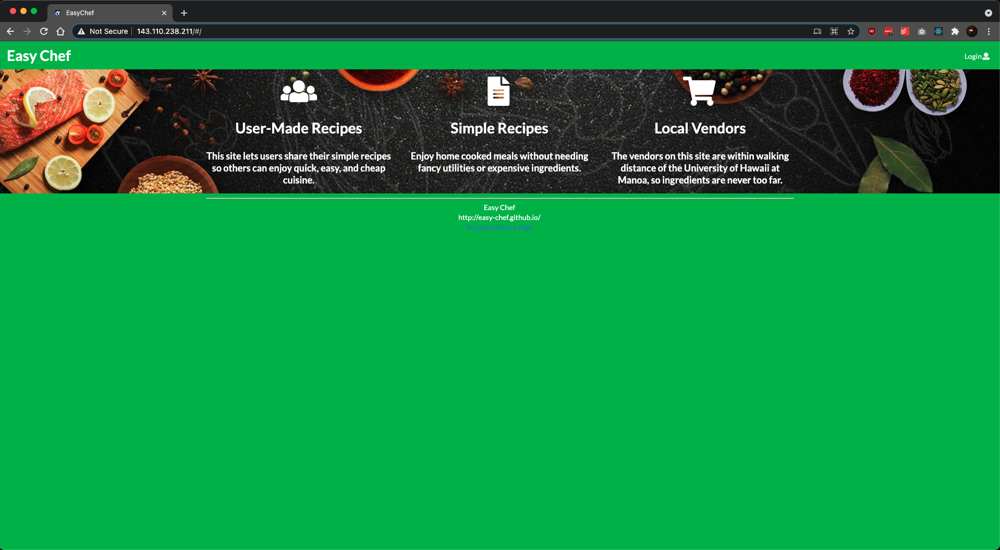
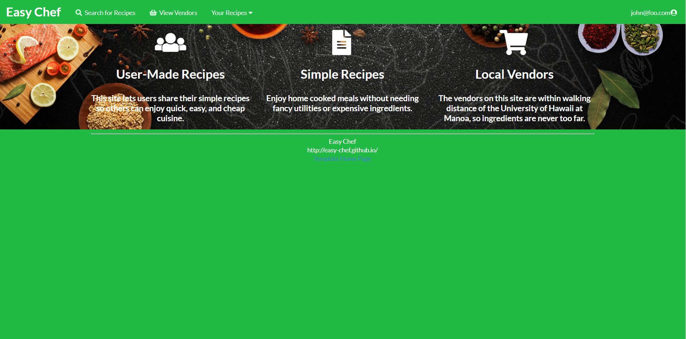
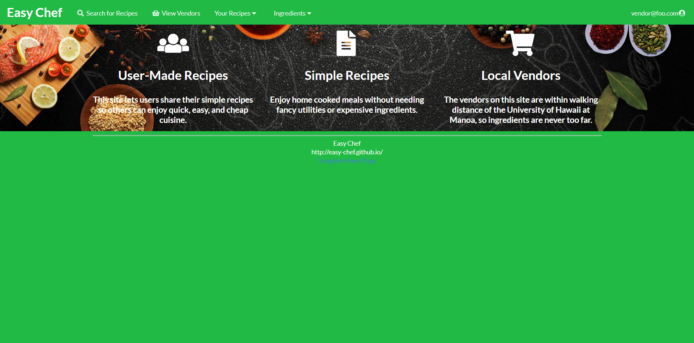
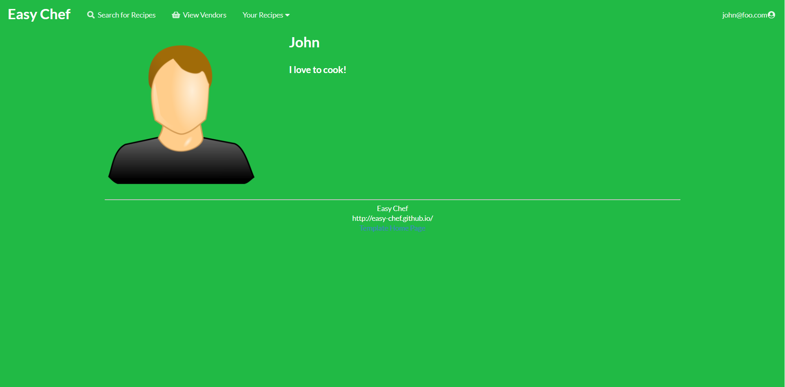
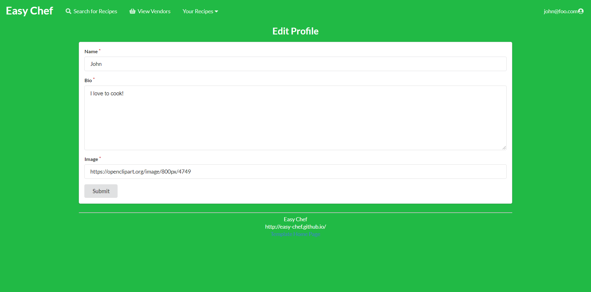
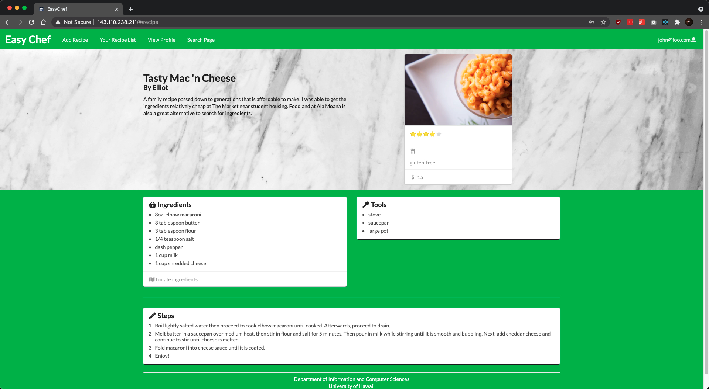

## Table of contents

* [Overview](#overview)
* [Deployment](#deployment)
* [User Guide](#user-guide)
* [Development History and Milestones](#development-history-and-milestones)
* [Team](#team)

## Overview

For college students, money is always of concern for anything including the meals that we prepare. Creating meals can be
difficult for various reasons such as limited kitchen resources, cooking ability, and ingredient availability. No longer will a
student simply resort to only a cup of noodles. With EasyChef, anyone can discover delicious recipes that is easy to
make.

EasyChef is a web application that provides pages to view and (in some cases) modify profiles, recipes, and
vendors. The goal is provide an application that the UH community will use in order discover simple and affordable
recipes for their meals including where to get its associated ingredients. It illustrates various technologies
including:

* [Meteor](https://www.meteor.com/): Framework used for server and client code.
* [React](https://reactjs.org/): A Javascript library used to implement UI design.
* [Semantic UI React](https://react.semantic-ui.com/): CSS framework within react to implement UI components.
* [Uniforms](https://uniforms.tools/): Used to present and display form information when users create new items.

The following is what is currently planned for what the system will eventually provide:

* Three primary collections (Profiles, Recipes, Vendors) as well as two "join" Collections (ProfilesRecipes,
  VendorItems) that implement many-to-many relationships between them.
* Top-level index pages that will manipulate the collections above.
* Authentication system using the Meteor accounts package to verify the credentials of who logs-in to the system.
* Notification system that connects with the collections to notify when items are on sale or when a user has used an ingredient in their recipe.
* Rating system (5 stars) to rate user posted recipes and quality of ingredients posted by vendors.
* Map of the UH campus community to allow students to find ingredients posted by vendors and see if a certain vendor item is available at a certain location (ex. Foodland @ Ala Moana).

## Developer's Guide

### Deployment


Live deployment available [here.](https://easychef.xyz/#/)

### Installation

First, [install Meteor](https://www.meteor.com/install).

Second, go to [https://github.com/easy-chef/easy-chef](https://github.com/easy-chef/easy-chef), and click the "Use this template" button. Complete the dialog box to create a new repository that you own that is initialized with this template's files.

Third, go to your newly created repository, and click the "Clone or download" button to download your new GitHub repo to your local file system.  Using [GitHub Desktop](https://desktop.github.com/) is a great choice if you use MacOS or Windows.

Fourth, cd into the app/ directory of your local copy of the repo, and install third party libraries with:

```
$ meteor npm install
```

### Running the system

Once the libraries are installed, you can run the application by invoking the "start" script in the [package.json file](https://github.com/ics-software-engineering/meteor-application-template-react/blob/master/app/package.json):

```
$ meteor npm run start
```

The first time you run the app, it will create some default users and data. Here is the output:

```
meteor npm run start

> meteor-application-template-react@ start /Users/philipjohnson/github/ics-software-engineering/meteor-application-template-react/app
> meteor --no-release-check --settings ../config/settings.development.json

[[[[[ ~/github/ics-software-engineering/meteor-application-template-react/app ]]]]]

=> Started proxy.
=> Started MongoDB.
I20210427-11:36:34.839(-10)? Creating the default user(s)
I20210427-11:36:34.840(-10)?   Creating user admin@foo.com.
I20210427-11:36:35.150(-10)?   Creating user vendor@foo.com.
I20210427-11:36:35.432(-10)?   Creating user john@foo.com.
I20210427-11:36:35.704(-10)? Creating default recipes
I20210427-11:36:35.705(-10)?   Adding: Tasty Mac 'n Cheese (john@foo.com)
I20210427-11:36:35.724(-10)?   Adding: Chili Pasta (john@foo.com)
I20210427-11:36:35.729(-10)?   Adding: Green Smoothie (john@foo.com)
I20210427-11:36:35.736(-10)? Creating default Profiles.
I20210427-11:36:35.737(-10)?   Adding: John (john@foo.com)
I20210427-11:36:35.758(-10)?   Adding: Admin (admin@foo.com)
I20210427-11:36:35.760(-10)?   Adding: Vendor (vendor@foo.com)
I20210427-11:36:35.764(-10)? Creating default Vendors.
I20210427-11:36:35.765(-10)?   Adding: The Market (vendor@foo.com)
I20210427-11:36:35.795(-10)?   Adding: Foodland (vendor@foo.com)
I20210427-11:36:35.798(-10)? Creating default Ingredients.
I20210427-11:36:35.798(-10)?   Adding: Milk (vendor@foo.com)
I20210427-11:36:35.812(-10)?   Adding: Butter (vendor@foo.com)
I20210427-11:36:35.814(-10)?   Adding: Flour (vendor@foo.com)
I20210427-11:36:35.816(-10)?   Adding: Salt (vendor@foo.com)
I20210427-11:36:35.917(-10)? Monti APM: completed instrumenting the app
=> Started your app.


=> App running at: http://localhost:3000/
```


### Note regarding "bcrypt warning":

You will also get the following message when you run this application:

```
Note: you are using a pure-JavaScript implementation of bcrypt.
While this implementation will work correctly, it is known to be
approximately three times slower than the native implementation.
In order to use the native implementation instead, run

  meteor npm install --save bcrypt

in the root directory of your application.
```

On some operating systems (particularly Windows), installing bcrypt is much more difficult than implied by the above message. Bcrypt is only used in Meteor for password checking, so the performance implications are negligible until your site has very high traffic. You can safely ignore this warning without any problems during initial stages of development.

### Note regarding "MongoError: not master and slaveOk=false":

Intermittently, you may see the following error message in the console when the system starts up:

```
MongoError: not master and slaveOk=false
     at queryCallback (/Users/philipjohnson/.meteor/packages/npm-mongo/.3.1.1.1mmptof.qcqo++os+web.browser+web.browser.legacy+web.cordova/npm/node_modules/mongodb-core/lib/cursor.js:248:25)
     at /Users/philipjohnson/.meteor/packages/npm-mongo/.3.1.1.1mmptof.qcqo++os+web.browser+web.browser.legacy+web.cordova/npm/node_modules/mongodb-core/lib/connection/pool.js:532:18
     at _combinedTickCallback (internal/process/next_tick.js:131:7)
     at process._tickDomainCallback (internal/process/next_tick.js:218:9)
```

While irritating, this message appears to be harmless and [possibly related to a race condition between the development instance of Mongo and Meteor](https://github.com/meteor/meteor/issues/9026#issuecomment-330850366). By harmless, I mean that in most cases, the console goes on to display `App running at: http://localhost:3000/` and no problems occur during run time.

### Viewing the running app

If all goes well, the template application will appear at [http://localhost:3000](http://localhost:3000).  You can login using the credentials in [settings.development.json](https://github.com/ics-software-engineering/meteor-application-template-react/blob/master/config/settings.development.json), or else register a new account.

### ESLint

You can verify that the code obeys our coding standards by running ESLint over the code in the imports/ directory with:

```
meteor npm run lint
```

## Walkthrough

The following sections describe the major features of this template.

### Directory structure

The top-level directory structure is:

```
app/        # holds the Meteor application sources
config/     # holds configuration files, such as settings.development.json
doc/        # holds developer documentation, user guides, etc.
.gitignore  # don't commit IntelliJ project files, node_modules, and settings.production.json
```

This structure separates documentation files (such as screenshots) and configuration files (such as the settings files) from the actual Meteor application.

The app/ directory has this structure:

```
client/
  main.html      # The boilerplate HTML with a "root" div to be manipulated by React.
  main.js        # import startup files.
  style.css      # Style page

imports/
  api/           # Define collections
    profile/       # The Profile collection definition
    recipe/        # The Recipe collection definition
    vendor/        # The Vendor and Ingredient collection definition
  startup/       # Define code to run when system starts up (client-only, server-only, both)
    client/
    server/
  ui/
    layouts/     # Contains top-level layout (<App> component).
    pages/       # Contains components for each page.
    components/  # Contains page elements, some of which could appear on multiple pages.

node_modules/    # managed by npm

public/          # static assets (like images) can go here.

server/
   main.js       # import the server-side js files.
```

### Import conventions

This system adheres to the Meteor guideline of putting all application code in the imports/ directory, and using client/main.js and server/main.js to import the code appropriate for the client and server in an appropriate order.

## User Guide

In order for a user to access the functions of this website, they will have to sign up and/or log in (if the user is already signed up).  Users can also be registered as vendors, where they will be able to add and edit ingredients and their prices.  Vendors will have to be approved by the admin.

By default, each user is only able to edit their own recipes.  Also by default, each vendor is only able to edit their own ingredients.  However, the settings file enables you to define default accounts.  If you define a user with the role "admin", then that user gets access to special pages which lists all the recipes and ingredients defined by all users.

There will be screen shots of each page of the web application below.  Each page section will have a description of how to navigate to the page and the page's uses.

#### Landing Page

The landing page is presented to users when they visit the top-level URL to the site. It will be similar to the image
below that will serve as a basis for the final design.

(Below is a landing page with Meteor and React made as of [M1](https://github.com/easy-chef/easy-chef/projects/1))



#### User Home Page

The user home page is presented after a user logs-in with an account that has the "student" role. This page is similar to the landing page with the addition of new options such as "Add Recipe" that is available at the top of the navigation bar.

(Below is the user home page with Meteor and React made as of [M1](https://github.com/easy-chef/easy-chef/projects/1))



#### Vendor Home Page

The vendor home page is presented after a user logs-in with an account that has "vendor" role. Accounts with the "vendor" role will have unique options in the navigation bar such as "Add Ingredient."

(Below is the vendor home page with Meteor and React made as of [M1](https://github.com/easy-chef/easy-chef/projects/1))



#### Admin Home Page

The admin home page is presented after a user logs-in with an account that "admin" role. Accounts with the "admin" role has an additional option in the navigation bar called "Admin" that allows one to view all items (users, recipes, vendors, etc.) in the system.

(Below is the admin home page with Meteor and React made as of [M1](https://github.com/easy-chef/easy-chef/projects/1))


#### User Profile Page

To navigate to the user profile page, use the drop down menu where the username is displayed on the navigation bar, then click "View Profile".  Each user will have a personalized profile that presents information such as count of recipes added as well as favorite recipes shared by other users.  It will also present a bio where users can describe themselves within the UH community.  The mockup below represents a sample student profile.  Vendors may have profiles with other types of information.

(Below is the user profile page with Meteor and React made as of [M2](https://github.com/easy-chef/easy-chef/projects/2))



#### Edit Profile Page

To edit the information displayed in the user profile, use the dropdown menu where the username is displayed on the navigation bar, then click "Edit Profile".

(Below is the edit profile page with Meteor and React made as of [M2](https://github.com/easy-chef/easy-chef/projects/2))



#### NavBar Search Engine

A dedicated page to search all recipes that has been posted to the application.  Here, users can search by name and filter results based on dietary restrictions.  The page will present a list of cards with recipes that meet the search results.


#### Individual Recipe Page

The page dedicated to displaying information of a recipe that have been created by a student.  This page present information such as the recipe name, author, image, ingredients, steps, and total cost.  The ingredients will be tied to information posted by vendors to allow students to discover where in the UH area they will be able to find said ingredients and how much each item costs at a particular location.

(Below is an individual Recipe page with Meteor and React made as of [M1](https://github.com/easy-chef/easy-chef/projects/1))



## User Feedback 

Here are some thoughts from some UH community members about the EasyChef application:

<blockquote> User experience and navigating through the pages feels intuitive for a modern application. </blockquote>
<footer>Jorj C. (jcaguioa@hawaii.edu)</footer>

<blockquote> I like the design of the website it is easy to navigate and very user friendly. I like how the user is able to view a list of all recipes and adding new recipes is simple and clear. The vendor page is clean and has large logo to see who the venders are. I would like to see the home page with larger images because I feel like it is plain. Other than that I like the website and it’s usages.  </blockquote>
<footer>Daniel F. (dtf@hawaii.edu)</footer>

<blockquote> The website is nice because it's simple to navigate and I like the concept of easy recipes for those who don't have good cooking utilities.  A lot of people are staying home and bored, so they're getting into cooking and this is kind of nice because it's like FaceBook for beginning chefs. </blockquote>
<footer>Palmer T. (ptanaka@hawaii.edu)</footer>


## Development History and Milestones

The development process for EasyChef utilized
the [Issue Driven Project Management](http://courses.ics.hawaii.edu/ics314f19/modules/project-management/) practices.

In order to record the development history, various milestones will be documented which is presented below.

### Milestone 1: Mockup development

Completed as of 4/15/2021.  To view the work of our mockup development, visit our [M1 project board.](https://github.com/easy-chef/easy-chef/projects/1)

### Pre-Development Mockup

The UI mockups below were created using Photoshop and serves as the basis for the development for [Milestone 1](https://github.com/easy-chef/easy-chef/projects/1) where some pages were able to be implemented with Meteor and React.

#### Landing Page

The landing page is presented to users when they visit the top-level URL to the site. It will be similar to the image
below that will serve as a basis for the final design.


(Below is a landing page with Meteor and React made as of [M1](https://github.com/easy-chef/easy-chef/projects/1))


#### User Home Page

The user home page is presented after a user logs-in with an account that has the "student" role. This page is similar to the landing page with the addition of new options such as "Add Recipe" that is available at the top of the navigation bar.


#### Vendor Home Page

The vendor home page is presented after a user logs-in with an account that has "vendor" role. Accounts with the "vendor" role will have unique options in the navigation bar such as "Add Ingredient."


#### Admin Home Page

The admin home page is presented after a user logs-in with an account that "admin" role. Accounts with the "admin" role has an additional option in the navigation bar called "Admin" that allows one to view all items (users, recipes, vendors, etc.) in the system.


#### User Profile Page

Each user will have a personalized profile that presents information such as count of recipes added as well as favorite recipes shared by other users.  It will also present a bio where users can describe themselves within the UH community.  The mockup below represents a sample student profile.  Vendors may have profiles with other types of information.


To navigate to the user profile page, use the drop down menu where the username is displayed on the navigation bar, then click "View Profile".  To edit the information displayed, use the dropdown menu where the username is displayed on the navigation bar, then click "Edit Profile".

#### NavBar Search Engine

A dedicated page to search all recipes that has been posted to the application.  Here, users can search by name and filter results based on dietary restrictions.  The page will present a list of cards with recipes that meet the search results.


#### Individual Recipe Page

The page dedicated to displaying information of a recipe that have been created by a student.  This page present information such as the recipe name, author, image, ingredients, steps, and total cost.  The ingredients will be tied to information posted by vendors to allow students to discover where in the UH area they will be able to find said ingredients and how much each item costs at a particular location.


(Below is an individual Recipe page with Meteor and React made as of [M1](https://github.com/easy-chef/easy-chef/projects/1))


### Milestone 2: Implementation

Milestone 2 implementation currently finished as of 4/27/2021.  To view the work of this milestone, visit our [M2 project board.](https://github.com/easy-chef/easy-chef/projects/2)

#### Overview of M2
* Added collections such as Profiles, Recipes, and Vendors.
* Added forms to create profiles, ingredients and recipe.
* Implemented various pages to view profile, recipe and vendor information.

### Milestone 3: Completion

Milestone 3 implementation is currently in progress. To view our current progress, visit our [M3 project board.](https://github.com/easy-chef/easy-chef/projects/3)


## Team

EasyChef is designed, implemented, and maintained by the [easy-chef](https://github.com/easy-chef) organization:

* [Makana Lacson-Garrett](https://makanalg.github.io/)
* [Joshua Paino](https://joshipaino.github.io/)
* [Kat Shimomura](https://katshimomura.github.io/)
* [Karen Wong](https://karenwong-kw.github.io/)


