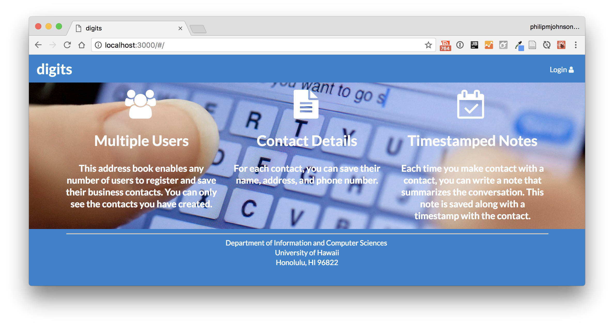

## Table of contents

* [Overview](#overview)
* [Deployment](#deployment)
* [User Guide](#user-guide)
* [Development History and Milestones](#development-history-and-milestones)
* [Team](#team)

## Overview

For college students, money is always of concern for anything including the meals that we prepare.  Creating meals can be difficult for various reasons such as kitchen resources, cooking ability, and ingredient availability.  No longer will a student simply resort to only a cup of noodles.  With EasyChef, anyone can discover delicious recipes that is easy to make.

Easy Chef is an example web application that provides pages to view and (in some cases) modify profiles, recipes, and vendors. The goal is provide an application that the UH community will use in order discover simple and affordable recipes for their meals including where to get its associated ingredients. It illustrates various technologies including:

* [Meteor](https://www.meteor.com/): Framework used for server and client code
* [React](https://reactjs.org/): A Javascript library used to implement UI design
* [Semantic UI React](https://react.semantic-ui.com/): CSS framework within react to implement UI components
* [Uniforms](https://uniforms.tools/): used to present and display form information.

The following is what is currently planned for what the system will eventually provide:

* Three primary collections (Profiles, Recipes, Vendors) as well as two "join" Collections (ProfilesRecipes, VendorItems) that implement many-to-many relationships between them.
* Top-level index pages (Profiles, Recipes, Vendors) that show how to manipulate these collections in various ways.
* Initialization code to define default Profiles, Recipes, Vendors and relations between them.
* Use of Meteor Methods to illustrate how to simplify implementation of multiple collection updates.
* Use of indexes to enforce uniqueness of certain fields in the collections, enabling them to serve as primary keys.
* Authentication using the built-in Meteor accounts package along with Sign Up and Sign In pages.
* Authorization examples: certain pages are public (SearchRecipes, Vendors, Profiles), while other pages require login (AddRecipe, EditProfile, EditVendor, MyRecipes).
* Use of Meteor Assets to initialize the database (helpful when initialization exceeds settings file size limits).

## Deployment

A live deployment of Easy Chef is soon to be available.

## User Guide

This section is soon to be available.

### Landing Page

The landing page is presented to users when they visit the top-level URL to the site.
It will be similar to the image below:

## Development History and Milestones

The development process for EasyChef utilized the [Issue Driven Project Management](http://courses.ics.hawaii.edu/ics314f19/modules/project-management/) practices.

In order to record the development history, various Milestones will be documents which is presented below.

### Milestone 1: Mockup development

Mockup development currently in progress

## Team

EasyChef is designed, implemented, and maintained by Makana Lacson-Garrett, Joshua Paino, Karen Wong, and Kat Shimomura.

